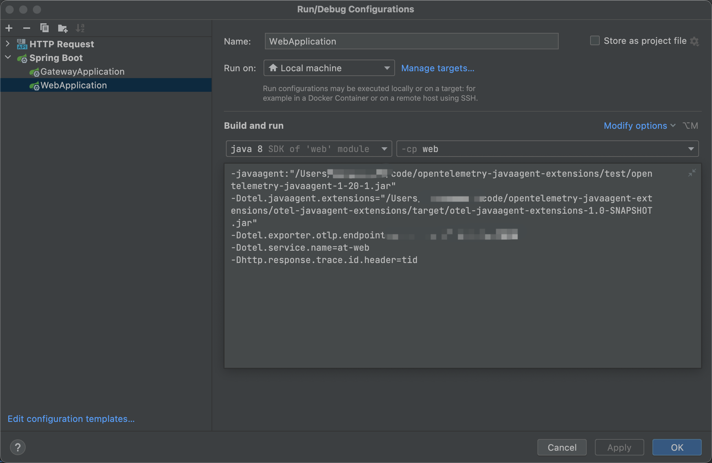

# opentelemetry-javaagent-extensions
对 opentelemetry-java-instrumentation 的补充

## Opentelemetry 简介

https://juejin.cn/post/7213307533279707196

## 为什么要扩展

opentelemetry 通过 javaagent 进行业务无感的遥感数据采集，但官方的 javaagent 不可能完美匹配我们所有的需求，例如
- “我根本不想要这个跨度”
- “我想修改或者删除特定遥感数据中的一些属性”：
- “我想控制遥感数据的上报策略以及它们的生命周期”：

javaagent 侧官方提供了如下定制化方案 https://opentelemetry.io/docs/instrumentation/java/extensions/


## 扩展如何使用

我们要做的就是使用 opentelemetry javaagent 提供的依赖制作一个扩展 jar 包, 假设叫 otel-javaagent-extensions-1.0-SNAPSHOT.jar，在业务应用启动时在 -Dotel.javaagent.extensions 后添加我们的扩展 jar 包就可以生效了

```shell
java -javaagent:/opentelemetry-javaagent.jar \
     -Dotel.javaagent.extensions=/otel-javaagent-extensions-1.0-SNAPSHOT.jar
     -jar app.jar
```

## 怎样进一步扩展（欢迎贡献）

**otel-javaagent-extensions 目录**

目录下为扩展的核心代码，为了减少学习成本，没有和官方案例一样使用 gradle 而是使用了 maven，
对扩展所需的依赖以及进行了管理，大家可以 `git clone` 下来按需进行改造，执行 `mvn clean package` 即可打包出扩展包

扩展 Instrumentation 编写 Advice 类注意点:
- Advice 当作是一段函数，不能当作一个类
- 只能通过类似方法注入，防止被类加载 `this.getClass().getName() + "$CustomServlet3ServerHandlerAdvice";`
- Advice 只能包含静态方法
- Advice 除了参数外只能调用 opentelemetry-javaagent-extension-api 包里的类，其他任何方法和常量都不能访问

**test 目录**

目录下为一些测试案例，启动时记得添加 agent



## 定制化功能

### 1 扩展 web 响应头添加 trace id 以及跨度属性


